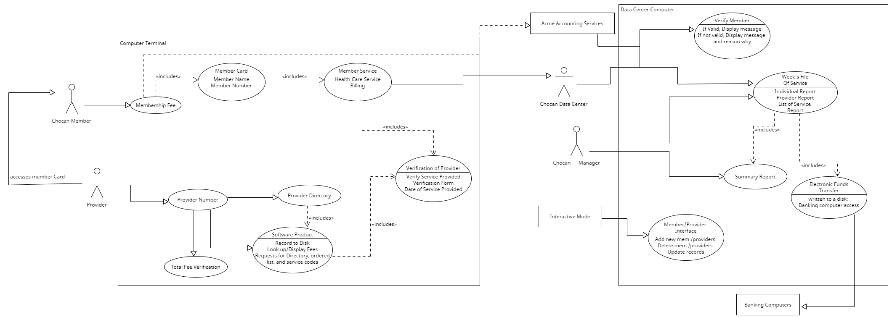

# cs200p1
project 1 repository for my group members and I to use

<!DOCTYPE html>

<html lang="en" xmlns="http://www.w3.org/1999/xhtml">
<head>
    <meta charset="UTF-8">
    <meta name="viewport" content="width=device-width, intial-scale=1.0" />
    <title>Report.html</title>
    
</head>

<body>
    <header>
        <h1>CS 200 Team 3 - Project 1</h1> <!--Title of the page-->
        <nav>
            <ul class="dropdown">
                <!--Creates a class for a dropdown menu-->
                <li>
                    <a href="#">Menu</a> <!--All content listed in dropdown menu-->
                    <ul class="dropdown-content">
                        <li><a href="#team">Team Members</a></li>
                        <li><a href="#taskTable">Task Distribution Table</a></li>
                        <li><a href="#summary">Summary</a></li>
                        <li><a href="#glossary">Glossary</a></li>
                        <li><a href="#useCaseDescription">Use Case Description</a></li>
                        <li><a href="#useCaseDiagram">Use Case Diagram</a></li>
                    </ul>
                </li>
            </ul>
        </nav>
    </header>

    <section id="team">
        <!--Section 1 - drop menu-->
        <h3>Team</h3>
        <table>
            <tbody>
                <!--Table of all team members -->
                <tr>
                    <td>Drew Estill</td>
                    <td>12205884</td>
                    <td>amestill@crimson.ua.edu</td>
                    <td>10 hours 45 minutes</td>
                </tr>
                <tr>
                    <td>Nuzhat Noeri</td>
                    <td>12326186</td>
                    <td>nnoeri@crimson.ua.edu</td>
                    <td>8 hours 5 minutes </td>
                </tr>
                <tr>
                    <td>Cody Caulfield</td>
                    <td>12447052</td>
                    <td>crcaulfield@crimson.ua.edu</td>
                    <td>6 hours 17 minutues </td>
                </tr>
                <tr>
                    <td>Darralynn Joiner (submitter)</td>
                    <td>11958020</td>
                    <td>dejoiner@crimson.ua.edu</td>
                    <td>7 hours 12 minutes </td>
                </tr>
            </tbody>
        </table>
    </section>

    <section id="taskTable">
        <!--Section 2 - drop down menu-->
        <h3> Task Distribution Table </h3>
        <table>
            <thead>
                <!--Header table-->
                <tr>
                    <th>Name</th>
                    <th>Task</th>
                    <th>Percent Complete</th>
                </tr>
            </thead>
            <tbody>
                <!--Indivual cells listed under header table-->
                <tr>
                    <td>Drew Estill</td>
                    <td>Use Case Diagram, Use Case Descriptions</td>
                    <td>25%</td>
                </tr>
                <tr>
                    <td>Nuhat Noeri</td>
                    <td>Use Case Diagram, Glossary</td>
                    <td>25%</td>
                </tr>
                <tr>
                    <td>Cody Caulfield</td>
                    <td>Use Case Diagram, Use Case Descriptions</td>
                    <td>25%</td>
                </tr>
                <tr>
                    <td>Darralynn Joiner</td>
                    <td>Use Case Diagram, Summary</td>
                    <td>25%</td>
                </tr>
            </tbody>
        </table>
    </section>

    <section id="summary">
        <!--Section 3 - drop down menu-->
        <h3>Summary</h3>
    </section>

    <section id="glossary">
        <!--Section 4 - drop down menu-->
        <body>
            <h2>Glossary</h2>

            <table>
                <tr>
                    <th>Term</th>
                    <th>Description</th>

                </tr>
                <tr>
                    <td>Member</td>
                    <td>
                        -individual subscribed to ChocAn  -pays monthly subscription  -receives services from Providers  -has a plastic membership card
                    </td>

                </tr>
                <tr>
                    <td>Membership Card</td>
                    <td>-plastic  -name of member  -9 digit member identification number</td>

                </tr>
                <tr>
                    <td>Member Identification Number</td>
                    <td>-9 digits  -Provider inputs this in terminal to check status  -valid/invalid/suspended</td>

                </tr>
                <tr>
                    <td>Provider</td>
                    <td>-healthcare professional who offers services to ChocAn  -inputs member identification number into a terminal to check member validation  -inputs a 6-digit service code into terminal for ChocAn Data Center to issue bill</td>

                </tr>
                <tr>
                    <td>
                        Provider Number<t /d>
                            <td>-9 digits  -given to each ChocAn provider and stored in the ChocAn Data Center</td>
                </tr>
                <tr>
                    <td>Service Code</td>
                    <td>-6 digits  -specific healthcare service  -found in the Provider Directory  Providers input thid code into terminal to issue bill</td>
                </tr>
                <tr>
                    <td>Provider Directory</td>
                    <td>-a list of service codes, service names, and service fees</td>
                </tr>
                <tr>
                    <td>ChocAn Data Center</td>
                    <td>-central system  -contains member, provider, service codes and details  -validates member status  -generates weekly reports  -generates EFT</td>
                </tr>
                <tr>
                    <td>Terminal</td>
                    <td>-used by Providers to input member identification code and service code  -output error message if not valid or suspended</td>
                </tr>
                <tr>
                    <td>Validity</td>
                    <td>-member identification code needs to be checked for validity for Providers to give service  -invalid if wrong/non-existing within ChocAn Data Center  -suspended if one month's subscription is not paid  -account will be reinstated after subscription is paid</td>
                </tr>
                <tr>
                    <td>Weekly Report</td>
                    <td>-generated by ChocAn Data Center  -members receive member report  -Providers receive provider report  -an EFT is generated</td>
                </tr>
                <tr>
                    <td>Member Report</td>
                    <td>-generated weekly  -includes services received, serice date, and Provider name</td>
                </tr>
                <tr>
                    <td>Provider Report</td>
                    <td>-generated weekly  -includes services provided, dates, service codes, fees</td>
                </tr>
                <tr>
                    <td>EFT</td>
                    <td>-a file containing details of provider payments  -provider name, provider number, amount to be paid  -sent to Banking service </td>
                </tr>
                <tr>
                    <td>Acme Accounting Service</td>
                    <td>-third party organisation  -handles ChocAn membership fee payment  -suspends member accounts if monthly fee is not paid  -reinstates after monthly fee is paid</td>
                </tr>
                <tr>
                    <td>Banking Service</td>
                    <td>-ChocAn Data Center sends the weekly generated EFT to process the payment to Providers</td>
                </tr>
            </table>

        </body>

    </section>

    <section id="useCaseDescription">
        <!--Section 5 - drop down menu-->
        <h3>Use Case Description</h3>
    </section>

    <section id="useCaseDiagram">
        <!--Section 6 - drop down menu-->
        <h3>Use Case Diagram</h3>
         <!--Image source for the file-->
    </section>

    <!--Button Operations-->
    <!--Creates a class and class function for a "Back to Top button"-->
    <button class="back-to-top" onclick="scrollToTop()">Back to Top</button>

    
</body>
</html>
